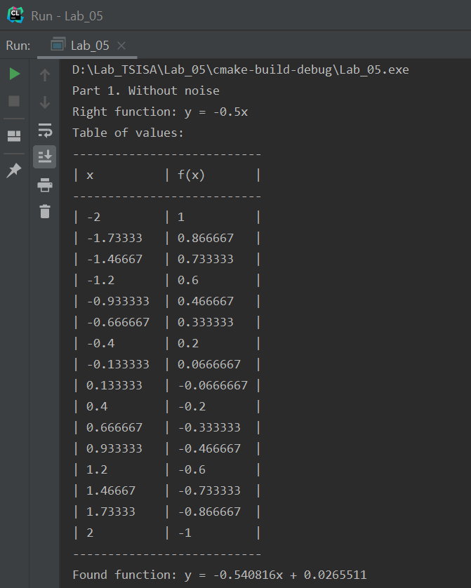
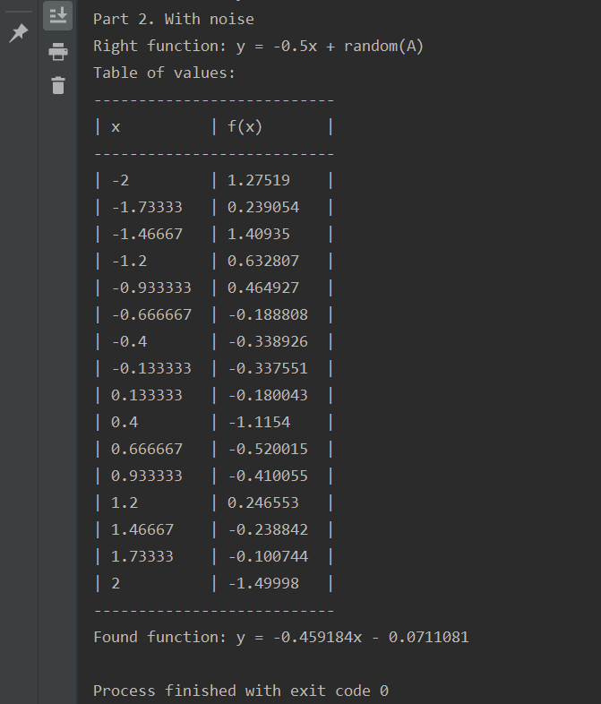

# Лабораторная работа №5 по Теории систем и системному анализу
Вариант 4
## Задание
В зависимости от варианта работы найти линейную регрессию функции y(x) = cx + d (коэффициенты наиболее подходящей прямой c, d) 
по набору ее дискретных значений, заданных равномерно на интервале [a,b] со случайными ошибками. Выполнить расчет параметров c, d 
градиентным методом. Провести двумерный пассивный поиск оптимальных весовых коэффициентов нейронной сети (НС) регрессии.

В модели линейной регрессии параметры должны быть выбраны таким образом, чтобы минимизировать сумму квадратов ошибок для всех точек (принцип наименьших квадратов).

c = -0.5, d = 0, a = -2, b = 2, N = 16, A = 2. Алгоритм поиска c - пассивный, алгоритм поиска d — случайный.
   
## Выполнение
Код файла, реализующего функцию имитации отжига, а также представляющего результаты в виде таблицы, приведен в main.cpp

